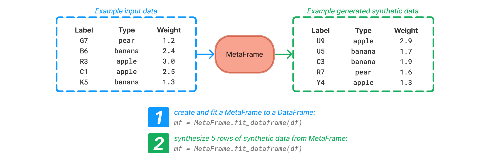

[](https://mybinder.org/v2/gh/sodascience/metasyn/HEAD?labpath=examples%2Fgetting_started.ipynb)
[](https://colab.research.google.com/github/sodascience/metasyn/blob/main/examples/getting_started.ipynb)
[](https://metasyn.readthedocs.io/en/latest/index.html)
[](https://hub.docker.com/r/sodateam/metasyn)


# Metasyn
Metasyn is a Python package for generating synthetic tabular data with a focus on privacy. It is designed for owners of sensitive datasets who want to share approximations of their data so that others can perform exploratory analysis and testing without disclosing real values.

Metasyn has three main functionalities:


1. **[Estimation](https://metasynth.readthedocs.io/en/latest/usage/generating_metaframes.html)**: Metasyn can create and fit a MetaFrame to a dataset. 
   - A MetaFrame is metadata that describes the structure of columns, without storing any entries. It captures individual distributions and features and enables the generation of synthetic data based on it. 
   - MetaFrames can be fitted to both [Pandas](https://pandas.pydata.org/) and [Polars](https://pola.rs/) DataFrames. 
   - Metasyn supports a variety of distribution and data types and can automatically select and fit to them. It also supports and detects columns with unique values or structured strings. 
   - Metasyn integrates with the [Faker](https://faker.readthedocs.io/en/master/) plugin to generate real-sounding entries for names, emails, phone numbers, etc. 
2. **[Generation](https://metasynth.readthedocs.io/en/latest/usage/generating_synthetic_data.html)**: Metasyn can generate synthetic data based on a MetaFrame. The generated data depends solely on the MetaFrame that was used as input, thereby effectively separating the original (sensitive) data from the generated synthetic data.
3. **[Serialization](https://metasynth.readthedocs.io/en/latest/usage/exporting_metaframes.html)**: Metasyn can import and export MetaFrames to and from easy-to-read [Generative Metadata Format (GMF)](https://metasyn.readthedocs.io/en/latest/developer/GMF.html) files. This allows users to audit, understand, and modify their data generation model.

  
Metasyn is built with extensibility in mind, allowing for easy integration of custom distribution types or privacy extensions.


 **Example**: 

 
 


## Getting started
### Installing metasyn
Metasyn can be installed directly from PyPI using the following command in the terminal:

```sh
pip install metasyn
```

After that metasyn is available to use in your Python scripts and notebooks. It will also be accessible through its [command-line interface](https://metasyn.readthedocs.io/en/latest/usage/cli.html).

For more information on installing metasyn, refer to the [installation guide](https://metasyn.readthedocs.io/en/latest/usage/installation.html).

It is also possible to run and access metasyn's CLI through a Docker container available on [Docker Hub](https://hub.docker.com/r/sodateam/metasyn).  


### Quick start guide
The [quick start guide](https://metasyn.readthedocs.io/en/latest/usage/quick_start.html) on our documentation provides an introduction on the functionality and workflow of metasyn. 

### Tutorial
Additionally, the documentation offers an [interactive tutorial](https://metasyn.readthedocs.io/en/latest/usage/interactive_tutorials.html) (Jupyter Notebook) which follows and expands on the quick start guide, providing a step-by-step walkthrough and example to get you started. 

This tutorial can be followed without having to install metasyn locally by running it in Google Colab or Binder.

### Documentation
For a detailed overview of metasyn, refer to the [documentation](https://metasyn.readthedocs.io/en/latest/index.html). The documentation covers everything you need to know to get started with metasyn, including installation, usage, and examples.

<!-- CONTRIBUTING -->
## Contributing
Contributions are what make the open-source community an great place to learn, inspire, and create.

Any contributions you make are greatly appreciated.

To contribute:
1. Fork the Project
2. Create your Feature Branch (`git checkout -b feature/AmazingFeature`)
3. Commit your changes (`git commit -m 'Add some AmazingFeature'`)
4. Push to the Branch (`git push origin feature/AmazingFeature`)
5. Open a Pull Request


<!-- CONTACT -->
## Contact
**Metasyn** is a project by the [ODISSEI Social Data Science (SoDa)](https://odissei-data.nl/nl/soda/) team.
Do you have questions, suggestions, or remarks on the technical implementation? File an issue in the issue tracker or feel free to contact [Erik-Jan van Kesteren](https://github.com/vankesteren) or [Raoul Schram](https://github.com/qubixes).

 
