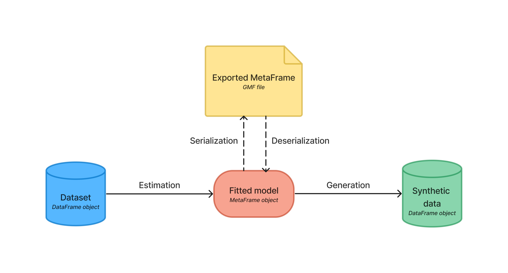

[](https://mybinder.org/v2/gh/sodascience/metasyn/HEAD?labpath=examples%2Fgetting_started.ipynb)
[](https://colab.research.google.com/github/sodascience/metasyn/blob/main/examples/getting_started.ipynb)
[](https://metasyn.readthedocs.io/en/latest/index.html)


# Metasyn
Metasyn is a Python package designed to generate tabular synthetic data for rigorous code testing and reproducibility.
Researchers and data owners can use metasyn to generate and share synthetic versions of their sensitive datasets, mitigating privacy concerns. Additionally, metasyn facilitates transparency and reproducibility, by allowing the underlying MetaFrames to be exported and shared. Other researchers can use these to regenerate consistent synthetic datasets, validating published work without requiring sensitive data.

The package has three main functionalities:

1. **Estimation**: Metasyn can create a MetaFrame, from a dataset. A MetaFrame is essentially a fitted model that characterizes the structure of the original dataset without storing actual values. It captures individual distributions and features, enabling generation of synthetic data based on these MetaFrames and can be seen as (statistical) metadata.
2. **Serialization**: Metasyn can export a MetaFrame into an easy to read JSON file, allowing users to audit, understand, and modify their data generation model.
3. **Generation**: Metasyn can generate synthetic data based on a MetaFrame. The synthetic data produced solely depends on the MetaFrame, thereby maintaining a critical separation between the original sensitive data and the synthetic data generated. The generated synthetic data, emulates the original data's format and plausibility at the individual record level and attempts to reproduce marginal (univariate) distributions where possible. Generated values are based on the observed distributions while adding a degree of variance and smoothing. The generated data does **not** aim to preserve the relationships between variables. The frequency of missing values and their codes are maintained in the synthetically-augmented dataset. 



### Key features
-   **MetaFrame Generation**: Metasyn allows the creation of a MetaFrame from a dataset provided as a Polars or Pandas DataFrame.
    MetaFrames includes key characteristics such as *variable names*, *data types*, *the percentage of missing values*, and *distribution parameters*.
-   **Exporting MetaFrames**: Metasyn can export and import MetaFrames to GMF files. These are JSON files that follow the easy to read and understand [Generative Metadata Format (GMF)](https://github.com/sodascience/generative_metadata_format).

    <details> 
    <summary> A simple example of an exported MetaFrame (following the GMF standard): </summary>

    ```json
    {
        "n_rows": 5,
        "n_columns": 5,
        "provenance": {
            "created by": {
                "name": "Metasyn",
                "version": "0.4.0"
            },
            "creation time": "2023-08-07T12:04:40.669740"
        },
        "vars": [
            {
                "name": "ID",
                "type": "discrete",
                "dtype": "Int64",
                "prop_missing": 0.0,
                "distribution": {
                    "implements": "core.unique_key",
                    "provenance": "builtin",
                    "class_name": "UniqueKeyDistribution",
                    "parameters": {
                        "low": 1,
                        "consecutive": 1
                    }
                }
            },
            {
                "name": "fruits",
                "type": "categorical",
                "dtype": "Categorical",
                "prop_missing": 0.0,
                "distribution": {
                    "implements": "core.multinoulli",
                    "provenance": "builtin",
                    "class_name": "MultinoulliDistribution",
                    "parameters": {
                        "labels": [
                            "apple",
                            "banana"
                        ],
                        "probs": [
                            0.4,
                            0.6
                        ]
                    }
                }
            },
            {
                "name": "B",
                "type": "discrete",
                "dtype": "Int64",
                "prop_missing": 0.0,
                "distribution": {
                    "implements": "core.poisson",
                    "provenance": "builtin",
                    "class_name": "PoissonDistribution",
                    "parameters": {
                        "mu": 3.0
                    }
                }
            },
            {
                "name": "cars",
                "type": "categorical",
                "dtype": "Categorical",
                "prop_missing": 0.0,
                "distribution": {
                    "implements": "core.multinoulli",
                    "provenance": "builtin",
                    "class_name": "MultinoulliDistribution",
                    "parameters": {
                        "labels": [
                            "audi",
                            "beetle"
                        ],
                        "probs": [
                            0.2,
                            0.8
                        ]
                    }
                }
            },
            {
                "name": "optional",
                "type": "discrete",
                "dtype": "Int64",
                "prop_missing": 0.2,
                "distribution": {
                    "implements": "core.discrete_uniform",
                    "provenance": "builtin",
                    "class_name": "DiscreteUniformDistribution",
                    "parameters": {
                        "low": -30,
                        "high": 301
                    }
                }
            }
        ]
    }
    ```

    A more advanced example GMF, based on the [Titanic](https://raw.githubusercontent.com/pandas-dev/pandas/main/doc/data/titanic.csv) dataset, can be found [here](examples/titanic_example.json)
    </details>

-   **Synthetic Data Generation**: Metasyn allows for the generation of a polars DataFrame with synthetic data that resembles the original data.
-   **Distribution Fitting**: Metasyn allows for manual and automatic distribution fitting.
-   **Data Type Support**: Metasyn supports generating synthetic data for a variety of common data types including `categorical`, `string`, `integer`, `float`, `date`, `time`, and `datetime`.
-   **Integration with Faker**: Metasyn integrates with the [faker](https://github.com/joke2k/faker) package, a Python library for generating fake data such as names and emails. Allowing for synthetic data that is formatted realistically, while retaining privacy.
-   **Structured String Detection**: Metasyn identifies structured strings within your dataset, which can include formatted text,
    codes, identifiers, or any string that follows a specific pattern.
-   **Handling Unique Values**: Metasyn can identify and process variables with unique values or keys in the data, preserving their uniqueness in the synthetic dataset, which is crucial for generating synthetic data that maintains the characteristics of the original dataset.

Curious and want to learn more? Check out our[documentation](https://metasyn.readthedocs.io/en/latest/index.html)!

## Getting Started
### Try it out online
If you're new to Python or simply want to quickly explore the basic features of metasyn, you can try it out using the online Google Colab tutorial. [Click here](https://colab.research.google.com/github/sodascience/metasyn/blob/main/examples/getting_started.ipynb) to access the tutorial. It provides a step-by-step walkthrough and example dataset to help you get started. However, please exercise caution when using sensitive data, as it will be handled through Google servers.

### Local Installation
For more advanced users and researchers who prefer working on their local machines, you can install metasyn directly from PyPI using the following command in the terminal (not Python):

```sh
pip install metasyn
```

## Usage
To learn how to use metasyn effectively, refer to the comprehensive [documentation](https://metasyn.readthedocs.io/en/latest/index.html). The documentation covers all the necessary information and provides detailed explanations, examples, and usage guidelines.

Additionally, the documentation offers a series of [tutorials](https://metasyn.readthedocs.io/en/latest/usage/interactive_tutorials.html) that delve into specific features and use cases. These tutorials can further assist you in understanding and leveraging the capabilities of metasyn.

### Quick start
Get started quickly with metasyn using the following example. In this concise demonstration, you'll learn the basic functionality of metasyn by generating synthetic data from [titanic](https://raw.githubusercontent.com/pandas-dev/pandas/main/doc/data/titanic.csv) dataset.

It is important to start by importing the appropriate libraries:

```python
# import libraries
import polars as pl
from metasyn import MetaFrame, demo_file
```

#### Estimation: Generating a MetaFrame 
##### 1.  Begin by creating a polars dataframe:
```python
# import the demo csv 
dataset_csv = demo_file() # This function automatically loads the Titanic dataset (as found here )

# create dataframe
data_types = {
    "Sex": pl.Categorical,
    "Embarked": pl.Categorical,
    "Survived": pl.Categorical,
    "Pclass": pl.Categorical,
    "SibSp": pl.Categorical,
    "Parch": pl.Categorical
}

df = pl.read_csv(dataset_csv, dtypes=data_types)
```

<details>
     <summary> 
     Note on using Pandas
     </summary>
     
Internally, metasyn uses Polars (instead of Pandas) mainly because typing and the handling of non-existing data is more
consistent. It is possible to supply a Pandas DataFrame instead of a polars DataFrame to `MetaFrame.fit_dataframe`.
However, this uses the automatic polars conversion functionality, which for some edge cases result in problems. Therefore,
we advise users to create Polars DataFrames. The resulting synthetic dataset is always a polars dataframe, but this can
be easily converted back to a Pandas DataFrame by using `df_pandas = df_polars.to_pandas()`.
</details>

##### 2. Next, we can generate a MetaFrame from the polars DataFrame.

```python
# create a MetaFrame (mf) from the DataFrame (df)
mf = MetaFrame.fit_dataframe(df)
```

> Note: At this point you will encounter a warning about `PassengerId` not being set as unique, you can safely ignore it and proceed. This warning occurs because `PassengerId` appears to contain unique values, but is not explicitly marked as a unique column. To remove the warning, you can set `PassengerId` to be a unique column. Our documentation explains how to do this when generating Metaframes: [Set Columns as Unique](https://metasyn.readthedocs.io/en/latest/usage/generating_metaframes.html#optional-parameters).

#### (De)serialization: Exporting and importing a MetaFrame 
_Note that exporting and importing is optional. You can generate synthetic data from **any** loaded MetaFrame, whether that be through importing a GMF file or generating a MetaFrame from an original DataFrame._

##### 3. We can export this MetaFrame to a GMF file using:

```python
# export MetaFrame
mf.export("exported_metaframe.json")
```

##### 4. Similarly, we can import a MetaFrame from a GMF file using:
```python
# load MetaFrame
mf = MetaFrame.from_json("exported_metaframe.json")
```

#### Generation: Generating synthetic data
##### 5. Finally, we can generate a DataFrame with synthetic data based on a MetaFrame using:

```python
# synthesize a DataFrame with 5 rows of data based on a MetaFrame
synthetic_data = mf.synthesize(5) 
```

<!-- CONTRIBUTING -->
## Contributing
Contributions are what make the open source community an amazing place to learn, inspire, and create.

Any contributions you make are greatly appreciated.

To contribute:
1. Fork the Project
2. Create your Feature Branch (`git checkout -b feature/AmazingFeature`)
3. Commit your Changes (`git commit -m 'Add some AmazingFeature'`)
4. Push to the Branch (`git push origin feature/AmazingFeature`)
5. Open a Pull Request


<!-- CONTACT -->
## Contact
**Metasyn** is a project by the [ODISSEI Social Data Science (SoDa)](https://odissei-data.nl/nl/soda/) team.
Do you have questions, suggestions, or remarks on the technical implementation? File an issue in the issue tracker or feel free to contact [Erik-Jan van Kesteren](https://github.com/vankesteren) or [Raoul Schram](https://github.com/qubixes).

 
