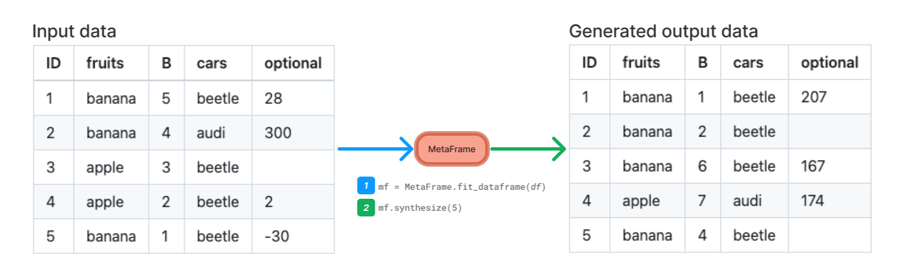

<p align="center">
  </img>
  <h3 align="center">Transparent and privacy-friendly synthetic data generation</h3>
  <p align="center">
    <span>
        <a href="https://www.repostatus.org/#wip"></a>
        <a href="https://pypi.org/project/metasyn"></img></a>
        <a href="https://colab.research.google.com/github/sodascience/metasyn/blob/main/examples/getting_started.ipynb"></img></a>
        <a href="https://metasyn.readthedocs.io/en/latest/index.html"></img></a>
        <a href="https://hub.docker.com/r/sodateam/metasyn"></img></a>
        <a href="https://zenodo.org/doi/10.5281/zenodo.7696031"></a>
    </span>
  </p>
</p>
<br/>

__Generate synthetic tabular data__ in a transparent, understandable, and privacy-friendly way. Metasyn makes it possible for owners of sensitive data to create test data, do open science, improve code reproducibility, encourage data reuse, and enhance accessibility of their datasets, without worrying about leaking private information. 

With metasyn you can __fit__ a model to an existing dataframe, __export__ it to a transparent and auditable `.json` file, and __synthesize__ a dataframe that looks a lot like the real one. In contrast to most other synthetic data software, we make the explicit choice to strictly limit the statistical information in our model in order to adhere to the highest privacy standards.

## Highlights
- 👋 __Accessible__. Metasyn is designed to be easy to use and understand, and we do our best to be welcoming to newcomers and novice users. [Let us know](https://github.com/sodascience/metasyn/issues/new) if we can improve!
- ✨ __Fully featured__. Out of the box, metasyn natively handles a wide range of data types, missing values, categorical data, key columns with unique values, and structured strings such as postcodes or identifiers.
- 🔎 __Transparent__. With metasyn you share not only synthetic data, but also the model and settings used to create it through a traceable, auditable metadata format. Everyone can read and understand what the model does; it is crystal clear which information becomes public.
- 🔐 __Private__. By default, metasyn does not incorporate multivariate information, meaning less risk of privacy issues such as identity, attribute, or group disclosure. On top of this, we support privacy plugins such as our own [disclosure control plugin](https://github.com/sodascience/metasyn-disclosure-control) to further enhance privacy in critically sensitive situations.
- 🔗 __Integrated__. We integrate closely with popular, modern tools in the python ecosystem, building on the wonderful [polars](https://pola.rs/) dataframe library ([pandas](https://pandas.pydata.org/) is supported too), as well as [faker](https://faker.readthedocs.io/en/master/) to generate localized data for names, emails, and phone numbers, and more.
- 📦 __Extensible__. Are you missing features? Do you have a different definition of privacy? Our plugin system allows you (or your organisation) to create their own extension to adjust metasyn to what you need. Or you can [contribute](https://metasyn.readthedocs.io/en/latest/developer/contributing.html) directly to the project.

## Installation
Metasyn can be installed directly from PyPI using the following command in the terminal:

```sh
pip install metasyn
```

The latest (possibly unstable) development version can be installed directly from GitHub like so:

```sh
pip install git+https://github.com/sodascience/metasyn
```

## Usage
To generate synthetic data, `metasyn` first needs to fit a `MetaFrame` to the data which can then be used to produce new synthetic rows:



In Python code this happens as follows:

```python
import polars as pl
from metasyn import MetaFrame, demo_file

# Get the csv file path for built-in demo dataset
csv_path = demo_file("fruit")

# Create a polars dataframe from the csv file.
# It is important to ensure the data types are correct  
# when creating your dataframe, especially categorical data!
df = pl.read_csv(csv_path, dtypes={
  "fruits": pl.Categorical, 
  "cars": pl.Categorical
})

# Create a MetaFrame from the DataFrame.
mf = MetaFrame.fit_dataframe(df)

# Generate a new DataFrame with 5 rows from the MetaFrame.
df_synth = mf.synthesize(5)

# This DataFrame can be exported to csv, parquet, excel and more.
df_synth.write_csv("output.csv")
```

To explore more options and try this out online, take a look at our interactive tutorial:

[](https://colab.research.google.com/github/sodascience/metasyn/blob/main/examples/getting_started.ipynb)

For more information on how to create dataframes with polars, refer to the [Polars documentation](https://pola.rs/). Metasyn also works with pandas dataframes!

## Where to go next

- As a next step to learn more about generating synthetic data with metasyn we recommend to check out the [user guide](https://metasyn.readthedocs.io/en/latest/usage/usage.html).
- For even more privacy, have a look at our [disclosure control plugin](https://github.com/sodascience/metasyn-disclosure-control).
- To learn more about how `metasyn` works, go to detailed overview in our [documentation](https://metasyn.readthedocs.io/en/latest/about/metasyn_in_detail.html). 
- Want to create programs that build on metasyn? Take a look at our versioned [Docker containers](https://hub.docker.com/r/sodateam/metasyn) and our [CLI](https://metasyn.readthedocs.io/en/latest/usage/cli.html).


## Contributing
Metasyn is an open-source project, and we welcome contributions from the community.

To contribute to the codebase, follow these steps:
1. Fork the Project
2. Create your Feature Branch (`git checkout -b feature/AmazingFeature`)
3. Commit your changes (`git commit -m 'Add some AmazingFeature'`)
4. Push to the Branch (`git push origin feature/AmazingFeature`)
5. Open a Pull Request

More information on contributing can be found in the [contributing](https://metasyn.readthedocs.io/en/latest/developer/contributing.html) section of the documentation.


## Contact
**Metasyn** is a project by the [ODISSEI Social Data Science (SoDa)](https://odissei-data.nl/nl/soda/) team.
Do you have questions, suggestions, or remarks on the technical implementation? File an issue in the issue tracker or feel free to contact [Erik-Jan van Kesteren](https://github.com/vankesteren) or [Raoul Schram](https://github.com/qubixes).

 
