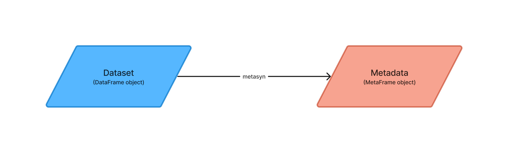
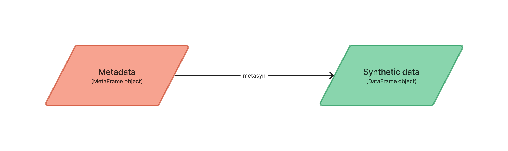

[](https://mybinder.org/v2/gh/sodascience/metasynth/HEAD?labpath=examples%2Fgetting_started.ipynb)
[](https://colab.research.google.com/github/sodascience/metasynth/blob/main/examples/getting_started.ipynb)
[](https://metasynth.readthedocs.io/en/latest/index.html)


# MetaSynth
MetaSynth is a Python package designed to generate tabular synthetic data for rigorous code testing and reproducibility.

The package has two main functionalities. First, it allows for the **creation of metadata** from an input dataset. This metadata describes the overarching structure and traits of the dataset. Second, MetaSynth allows for **generation of synthetic data** that aligns with this metadata. Instead of relying on the original dataset, the synthetic data is produced using the metadata. This approach ensures that the synthetic dataset remains separate and independent from any sensitive source data. Researchers and data owners can leverage this capability to generate and share synthetic versions of their sensitive data, mitigating privacy concerns. Furthermore, this separation between metadata and original data promotes reproducibility, as the metadata file can be easily shared and used to generate consistent synthetic datasets.


## Features
### Generating metadata from a dataset
MetaSynth can generate metadata from any given dataset (provided as polars or pandas dataframe). 

This metadata describes the structure and characteristics of the variables in the synthetic dataset (including their names, types, data types, proportion of missing values, and distribution specifications). 

This metadata follows the GMF standard, [Generative Metadata Format (GMF)](https://github.com/sodascience/generative_metadata_format) and as such is designed to be easy to read. It can be exported as .JSON file allowing for manual and automatic editing, as well as easy sharing.





<details> 
<summary> A simple example of a GMF file: </summary>

```json
 {
    "n_rows": 5,
    "n_columns": 5,
    "provenance": {
        "created by": {
            "name": "MetaSynth",
            "version": "0.4.0"
        },
        "creation time": "2023-08-07T12:04:40.669740"
    },
    "vars": [
        {
            "name": "ID",
            "type": "discrete",
            "dtype": "Int64",
            "prop_missing": 0.0,
            "distribution": {
                "implements": "core.unique_key",
                "provenance": "builtin",
                "class_name": "UniqueKeyDistribution",
                "parameters": {
                    "low": 1,
                    "consecutive": 1
                }
            }
        },
        {
            "name": "fruits",
            "type": "categorical",
            "dtype": "Categorical",
            "prop_missing": 0.0,
            "distribution": {
                "implements": "core.multinoulli",
                "provenance": "builtin",
                "class_name": "MultinoulliDistribution",
                "parameters": {
                    "labels": [
                        "apple",
                        "banana"
                    ],
                    "probs": [
                        0.4,
                        0.6
                    ]
                }
            }
        },
        {
            "name": "B",
            "type": "discrete",
            "dtype": "Int64",
            "prop_missing": 0.0,
            "distribution": {
                "implements": "core.poisson",
                "provenance": "builtin",
                "class_name": "PoissonDistribution",
                "parameters": {
                    "mu": 3.0
                }
            }
        },
        {
            "name": "cars",
            "type": "categorical",
            "dtype": "Categorical",
            "prop_missing": 0.0,
            "distribution": {
                "implements": "core.multinoulli",
                "provenance": "builtin",
                "class_name": "MultinoulliDistribution",
                "parameters": {
                    "labels": [
                        "audi",
                        "beetle"
                    ],
                    "probs": [
                        0.2,
                        0.8
                    ]
                }
            }
        },
        {
            "name": "optional",
            "type": "discrete",
            "dtype": "Int64",
            "prop_missing": 0.2,
            "distribution": {
                "implements": "core.discrete_uniform",
                "provenance": "builtin",
                "class_name": "DiscreteUniformDistribution",
                "parameters": {
                    "low": -30,
                    "high": 301
                }
            }
        }
    ]
}
```

A more advanced example GMF, based on the [Titanic](https://raw.githubusercontent.com/pandas-dev/pandas/main/doc/data/titanic.csv) dataset, can be found [here](examples/titanic_example.json)
</details>


### Generating synthetic data from a GMF file
MetaSynth can then be used to **generate synthetic data** from any GMF standard .JSON file.



The generated synthetic data, emulates the original data's format and plausibility at the individual record level and attempts to reproduce marginal (univariate) distributions where possible. Generated values are based on the observed distributions while adding a degree of variance and smoothing. The generated data does **not** aim to preserve the relationships between variables. The frequency of missing values and their codes are maintained in the synthetically-augmented dataset. 

### Overview of features
- **Metadata Generation**: MetaSynth allows the extraction of metadata from a dataset provided as a Polars or Pandas dataframe. Metadata includes key characteristics such as variable names, types, data types, the percentage of missing values, and distribution attributes.
- **Synthetic Data Generation**: MetaSynth allows for the generation of a polars DataFrame with synthetic data that resembles the original data.
- **GMF Standard**: MetaSynth utilizes the Generative Metadata Format (GMF) standard for metadata export and import. 
- **Distribution Fitting**: MetaSynth allows for manual and automatic distribution fitting.
- **Data Type Support**: MetaSynth supports generating synthetic data for a variety of common data types including `categorical`, `string`, `integer`, `float`, `date`, `time`, and `datetime`.
- **Integration with Faker**: MetaSynth integrates with the [faker](https://github.com/joke2k/faker) package, a Python library for generating fake data such as names and emails. Allowing for more realistic synthetic data.    
- **Structured String Detection**: MetaSynth identifies structured strings within your dataset, which can include formatted text, codes, identifiers, or any string that follows a specific pattern.
- **Handling Unique Values**: MetaSynth can identify and process variables with unique values or keys in the data, preserving their uniqueness in the synthetic dataset, which is crucial for generating synthetic data that maintains the characteristics of the original dataset.


## Getting Started
### Try it out online
If you're new to Python or simply want to quickly explore the basic features of MetaSynth, you can try it out using the online Google Colab tutorial. [Click here](https://colab.research.google.com/github/sodascience/metasynth/blob/main/examples/getting_started.ipynb) to access the tutorial. It provides a step-by-step walkthrough and example dataset to help you get started. However, please exercise caution when using sensitive data, as it will be handled through Google servers.

### Local Installation

For more advanced users and researchers who prefer working on their local machines, you can install MetaSynth directly from PyPI using the following command in the terminal (not Python):

```sh
pip install metasynth
```

## Usage

To learn how to use MetaSynth effectively, refer to the comprehensive [documentation](https://metasynth.readthedocs.io/en/latest/index.html). The documentation covers all the necessary information and provides detailed explanations, examples, and usage guidelines.

Additionally, the documentation offers a series of [tutorials](https://metasynth.readthedocs.io/en/latest/index.html) that delve into specific features and use cases. These tutorials can further assist you in understanding and leveraging the capabilities of MetaSynth.

### Quick start
Get started quickly with MetaSynth using the following example. In this concise demonstration, you'll learn the basic functionality of MetaSynth by generating synthetic data from [titanic](https://raw.githubusercontent.com/pandas-dev/pandas/main/doc/data/titanic.csv) dataset.

It is important to start by importing the appropriate libraries:

```python
# import libraries
import polars as pl
import metasynth as ms
```

#### Generating metadata
##### 1.  Begin by creating a polars dataframe:
```python
# import the demo csv 
dataset_csv = ms.demo_file() # This function automatically loads the Titanic dataset (as found here )


# create dataframe
dtypes = { 
    "Sex": pl.Categorical,
    "Embarked": pl.Categorical,
    "Survived": pl.Categorical,
    "Pclass": pl.Categorical,
    "SibSp": pl.Categorical,
    "Parch": pl.Categorical
}

df = pl.read_csv(dataset_csv, dtypes=dtypes)
```

<details>
     <summary> 
     Note on using Pandas
     </summary>
     
Internally, MetaSynth uses polars (instead of pandas) mainly because typing and the handling of non-existing data is more
consistent. It is possible to supply a pandas DataFrame instead of a polars DataFrame to `MetaDataset.from_dataframe`.
However, this uses the automatic polars conversion functionality, which for some edge cases result in problems. Therefore,
we advise users to create polars DataFrames. The resulting synthetic dataset is always a polars dataframe, but this can
be easily converted back to a pandas DataFrame by using `df_pandas = df_polars.to_pandas()`.
</details>

##### 2. Next, we can generate a metadataset from the polars dataframe.

```python
# create metadata
metadata = ms.MetaDataset.from_dataframe(df)
```

> Note: if at this point you get the following warning about a potential unique variable, do not worry, it is safe to continue.
> 
> ```
> Variable PassengerId seems unique, but not set to be unique. Set the variable to be either unique or not unique to remove this warning. warnings.warn(f"\nVariable {series.name} seems unique, but not set to be unique.\n"
> ```

##### 3. We can export this metadataset to a .JSON file using:

```python
#export metadata
metadata.to_json("metadata.json")
```

#### Generating synthetic data

##### 1. We can load metadata from a .JSON file:
```python
# load metadata
metadata = ms.MetaDataset.from_json("metadata.json")
```

##### 2. We can then synthesize a series of rows, based on this metadata using:

```python
# synthesize 5 rows of data
synthetic_data = metadata.synthesize(5) 
```


<!-- CONTRIBUTING -->
## Contributing
Contributions are what make the open source community an amazing place to learn, inspire, and create.

Any contributions you make are greatly appreciated.

To contribute:
1. Fork the Project
2. Create your Feature Branch (`git checkout -b feature/AmazingFeature`)
3. Commit your Changes (`git commit -m 'Add some AmazingFeature'`)
4. Push to the Branch (`git push origin feature/AmazingFeature`)
5. Open a Pull Request


<!-- CONTACT -->
## Contact
**MetaSynth** is a project by the [ODISSEI Social Data Science (SoDa)](https://odissei-data.nl/nl/soda/) team.
Do you have questions, suggestions, or remarks on the technical implementation? File an issue in the
issue tracker or feel free to contact [Erik-Jan van Kesteren](https://github.com/vankesteren)
or [Raoul Schram](https://github.com/qubixes).

 
