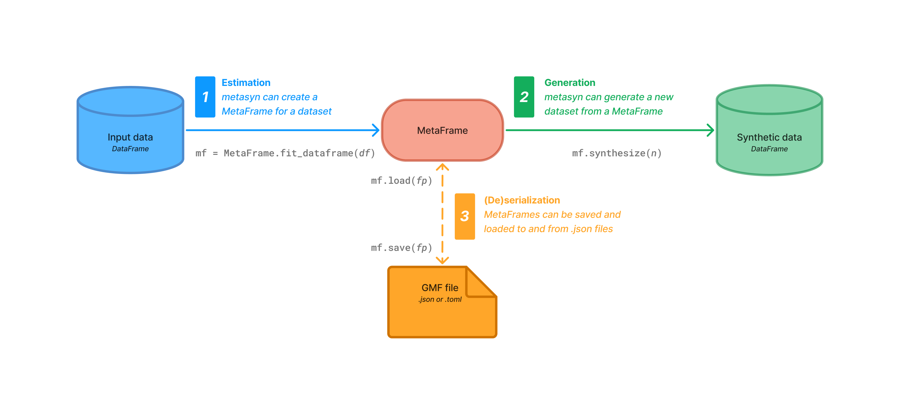

[](https://mybinder.org/v2/gh/sodascience/metasyn/HEAD?labpath=examples%2Fgetting_started.ipynb)
[](https://colab.research.google.com/github/sodascience/metasyn/blob/main/examples/getting_started.ipynb)
[](https://metasyn.readthedocs.io/en/latest/index.html)
[](https://hub.docker.com/r/sodateam/metasyn)


# Metasyn: 

## What is metasyn?

Metasyn is a Python package that **generates synthetic data**, and allows **sharing of the data generation model**, to facilitate collaboration and testing on sensitive data without exposing the original data.

It has three main functionalities:

1. **[Estimation](https://metasynth.readthedocs.io/en/latest/usage/generating_metaframes.html)**: Metasyn can analyze a dataset and create a *MetaFrame* for it. This is essentially a blueprint (or data generation model) that captures the structure and distributions of the columns without storing any entries.
2. **[Generation](https://metasynth.readthedocs.io/en/latest/usage/generating_synthetic_data.html)**: From a *MetaFrame*, metasyn can generate new synthetic data that resembles the original, on a column-by-column basis. 
3. **[Serialization](https://metasynth.readthedocs.io/en/latest/usage/exporting_metaframes.html)**: Metasyn can export and import *MetaFrames* to an easy-to-read format. This allows for easy modification and sharing of the model.




## Why Metasyn?
- **Privacy**: With metasyn you can share not only synthetic data, but also the model used to create it. This increases transparency and facilitates collaboration and testing on sensitive data without exposing the original data.
- **Extensible**: Metasyn is designed to be easily extendable and customizable and supports plugins for custom distributions and privacy control.
- **Faker**: Metasyn integrates with the [Faker](https://faker.readthedocs.io/en/master/) plugin to generate real-sounding entries for names, emails, phone numbers, etc.
- **DataFrame-based**: Metasyn is built on top of [Polars](https://pola.rs/), and supports both Polars and [Pandas](https://pandas.pydata.org/) DataFrames as input.
- **Flexibility**: Metasyn supports a variety of distribution and data types and can automatically select and fit to them. It also supports and detects columns with unique values or structured strings.
- **Ease of use**: Metasyn is designed to be easy to use and understand.

## Example
The following diagram shows how metasyn can generate synthetic data from an input dataset:


This can be reproduced using the following code:


```python
import polars as pl
from metasyn import MetaFrame
from metasyn.config import VarConfig
from metasyn.util import DistributionSpec

#### Polars Setup ####
# Metasyn relies on Polars (or Pandas) DataFrames. 
# For this example we'll create a simple Polars DataFrame.
df = pl.DataFrame(
    {
        "ID": [1, 2, 3, 4, 5],
        "fruits": ["banana", "banana", "apple", "apple", "banana"],
        "B": [5, 4, 3, 2, 1],
        "cars": ["beetle", "audi", "beetle", "beetle", "beetle"],
        "optional": [28, 300, None, 2, -30],
    }
)

# Categorical columns need to be casted to the Categorical type,
# so that metasyn can detect and fit to them.
df = df.with_columns([
    pl.col("fruits").cast(pl.Categorical),
    pl.col("cars").cast(pl.Categorical),
])

#### Metasyn ####
# We'll create a variable specification for the MetaFrame. 
# This specification allows us to direct how metasyn should fit to the data. 
# In this case, we want columns "ID" and "B" to be unique.

variable_specification = [
    VarConfig(name="ID", dist_spec=DistributionSpec(unique=True)),
    VarConfig(name="B", dist_spec=DistributionSpec(unique=True))
]

# We'll create a MetaFrame based on the DataFrame and the variable specification.
mf = MetaFrame.fit_dataframe(df, var_specs=variable_specification)

# We can now synthesize new data based on the MetaFrame.
mf_out.synthesize(5)
```

This example is the most basic use case, we recommend to check out the [User Guide](https://metasyn.readthedocs.io/en/latest/usage/usage.html) for a more detailed examples.


## Installing metasyn
Metasyn can be installed directly from PyPI using the following command in the terminal:

```sh
pip install metasyn
```

After that metasyn is available to use in your Python scripts and notebooks. It will also be accessible through its [command-line interface](https://metasyn.readthedocs.io/en/latest/usage/cli.html). It is also possible to run and access metasyn's CLI through a Docker container available on [Docker Hub](https://hub.docker.com/r/sodateam/metasyn).  

For more information on installing metasyn, refer to the [installation guide](https://metasyn.readthedocs.io/en/latest/usage/installation.html).


## Documentation and help
- **Documentation**: For a detailed overview of metasyn, refer to the [documentation](https://metasyn.readthedocs.io/en/latest/index.html). 
- **Quick-start:** Our [quick start guide](https://metasyn.readthedocs.io/en/latest/usage/quick_start.html) acts as a crash-course on the functionality and workflow of metasyn.
- **Interactive tutorial** Our [interactive tutorial](https://metasyn.readthedocs.io/en/latest/usage/interactive_tutorials.html) (Jupyter Notebook) follows and expands on the quick start guide, providing a step-by-step walkthrough and example to get you started. This tutorial can be followed without having to install metasyn locally by running it in Google Colab or Binder.

## Contributing
Metasyn is an open-source project, and we welcome contributions from the community.

To contribute to the codebase, follow these steps:
1. Fork the Project
2. Create your Feature Branch (`git checkout -b feature/AmazingFeature`)
3. Commit your changes (`git commit -m 'Add some AmazingFeature'`)
4. Push to the Branch (`git push origin feature/AmazingFeature`)
5. Open a Pull Request

More information on contributing can be found in the [contributing](https://metasyn.readthedocs.io/en/latest/developer/contributing.html) section of the documentation.


## Contact
**Metasyn** is a project by the [ODISSEI Social Data Science (SoDa)](https://odissei-data.nl/nl/soda/) team.
Do you have questions, suggestions, or remarks on the technical implementation? File an issue in the issue tracker or feel free to contact [Erik-Jan van Kesteren](https://github.com/vankesteren) or [Raoul Schram](https://github.com/qubixes).

 
